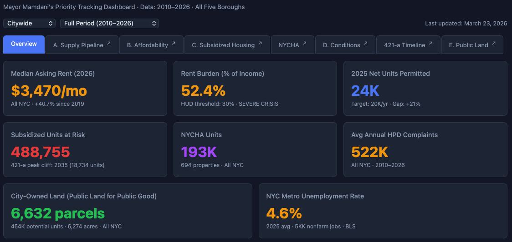

# NYC Housing Policy Analysis for Mayor Mamdani

[](Explorer_Master_Dashboard.html)

**Date:** March 24, 2026

**Scope:** Comprehensive data-driven housing policy analysis spanning supply, affordability, subsidized housing, building conditions, public land, and NYCHA capital needs across all five NYC boroughs.

- **Primary Deliverable:** [`Mamdani_Policy_Analysis_EXPANDED.md`](Mamdani_Policy_Analysis_EXPANDED.md)<br>a 2,600-line policy brief with six analytical sections, evidence-based findings, risk scenarios, and implementation roadmaps.

- **Supplementary Deliverables:** [`Housing Policy Master Dashboard`](Explorer_Master_Dashboard.html)<br>8 interactive dashboards in HTML format, detailed data source ontology, and methodological notes.

## What This Is

This project demonstrates an AI-driven policy analysis workflow built entirely with [Claude](https://claude.ai) using [Cowork mode](https://www.anthropic.com/product/claude-cowork) and the [qsv data wrangling plugin](https://github.com/dathere/qsv?tab=readme-ov-file#qsv-blazing-fast-data-wrangling-toolkit). Starting from raw public datasets, it produces a 2,600-line policy analysis document and 8 interactive dashboards — all generated through iterative conversation with Claude.

The scenario is a housing policy briefing for mayor Zohran Mamdani, pre-loading all the data in a Cowork project, with the prompt:

> "Can you analyze the NYC 311 files, the PLUTO file, the Furman Center Subsidized Housing and Neighborhood Indicator files (see https://www.furmancenter.org/data-tools-resources/data-tools-data-downloads/ for info),  NYC's Budget for FY 2025 (see https://www.nyc.gov/content/omb/pages/publications to retrieve files as needed), and do a comprehensive temporal analysis using the policy-analyst agent through the lens of Mayor Mamdani's priorities?"

After the initial analysis, Claude made additional recommendations for further analysis, and we onboarded additional datasets -StreetEasy market data, Census ACS estimates, BLS economic indicators, and NYCHA Physical Needs Assessments.

## Deliverables

### Primary Analysis

**`Mamdani_Policy_Analysis_EXPANDED.md`** (176 KB, ~2,600 lines)

The main deliverable — a comprehensive policy brief covering six analytical sections with data from 8 sources:

- **Section A: Supply Pipeline** — Permit trends, production gap analysis, borough-level completions (HousingDB)
- **Section B: Affordability Crisis** — Rent burden, income-rent divergence, bedroom-level analysis (StreetEasy, Census ACS, BLS)
- **Section C: Subsidized Housing & 421-a** — Subsidy portfolio risk, 421-a bimodal expiration timeline for 211,567 units (Furman Center)
- **Section D: Housing Conditions** — 9.83M HPD complaints over 16 years, seasonal patterns, borough disparities (311)
- **Section E: Public Land Inventory** — 6,632 developable city-owned parcels, 453,910 potential units by unused FAR (PLUTO)
- **NYCHA Capital Backlog** — $61.6B five-year / $78.6B twenty-year capital needs, system-by-system breakdown, 2023→2025 trend (NYCHA PNA)

Also includes: policy findings with evidence ratings, risk scenarios, implementation roadmaps, and full methodological notes with a confidence assessment table.

### Interactive Dashboards

All dashboards are self-contained HTML files using Chart.js 4.4.1. No server required — open in any browser. Each has borough and time/view filters, dark theme, and links back to the Master Dashboard.

| File | Description | Size |
|------|-------------|------|
| **`Explorer_Master_Dashboard.html`** | 7-tab hub linking all sections. Overview KPIs, borough filter, time period filter. | 100 KB |
| **`Explorer_A_Supply_Pipeline.html`** | Permit trends, completions lag, borough production comparison (2010–2026) | 56 KB |
| **`Explorer_B_Affordability.html`** | Rent trends by bedroom, income-rent gap, rent burden, StreetEasy + Census + BLS | 56 KB |
| **`Explorer_C_Subsidized_Housing.html`** | Subsidy portfolio by program, expiration risk, borough exposure | 28 KB |
| **`Explorer_D_Conditions.html`** | 311 HPD complaint volume, seasonal patterns, complaint types, borough trends | 28 KB |
| **`Explorer_421a_Timeline.html`** | 421-a expiration timeline 2026–2060, bimodal wave visualization, borough deep dive | 20 KB |
| **`Explorer_E_Public_Land.html`** | City-owned developable parcels, potential units, flood zone cross-reference | 20 KB |
| **`Explorer_NYCHA_Capital.html`** | PNA 2023 vs 2025 comparison, work type breakdown, top developments, cost distribution | 28 KB |

### Data Sources

| Source | Description | Coverage |
|--------|-------------|----------|
| **Furman Center SHD** | [Subsidized Housing Database](https://www.furmancenter.org/data-tools-resources/data-tools-data-downloads/) — BBL-level property records with subsidy programs, expiration dates, REAC scores, violations | 5,261 properties, May 2025 |
| **NYC PLUTO** | [Primary Land Use Tax Lot Output](https://data.cityofnewyork.us/City-Government/Primary-Land-Use-Tax-Lot-Output-PLUTO-/64uk-42ks/about_data) — tax lot characteristics, zoning, ownership, building area | 858,284 lots, Feb 2026 |
| **StreetEasy** |[Market data](https://streeteasy.com/blog/data-dashboard/) — median rent, sales prices, inventory, days on market, price indices | Borough-level, 2010–2026 |
| **NYC 311** | [Service requests](https://opendata.cityofnewyork.us/311-service-requests-from-2010-to-present-updates/) filtered to HPD housing complaints | 42.96M total / 9.83M HPD, 2010–2025 |
| **Census ACS** | via [Official US Census MCP Server](https://github.com/uscensusbureau/us-census-bureau-data-api-mcp) - American Community Survey 1-Year Estimates — income, rent, burden, tenure, poverty | 5 boroughs, 2010–2023 |
| **BLS** | Bureau of Labor Statistics via [BLS MCP Server](https://github.com/larasrinath/bls_mcp) — CPI, shelter inflation, unemployment, wages | NYC metro, 2010–2026 |
| **NYCHA PNA** | [Physical Needs Assessment](https://www.nyc.gov/site/nycha/about/reports.page) development-level results | 233 developments, 2023 & 2025 |
| **DCP HousingDB** | [NYC housing permit and completion database](https://www.nyc.gov/content/planning/pages/resources/datasets/housing-project-level) | Post-2010 permits |

## Key Findings

1. **Housing production falls 29% short** of the 20,000 units/year target (17,669 permitted in 2025)
2. **Rents up 45–90% since 2010** depending on borough; Bronx worst at 89.9% growth with 75.9% rent burden
3. **211,567 units face 421-a expiration** in two waves: 2026–2035 (99,051 units) and 2052–2059 (61,088 units); 93.8% of portfolio already tax-delinquent
4. **$61.6B NYCHA capital backlog** accelerating — per-unit costs surged 8.0% in two years despite 31 developments leaving for PACT/RAD
5. **9.83M HPD complaints** over 16 years, hitting record 774,437 in 2025 (+66% vs 2019); heat/hot water dominates at 40.8%
6. **6,632 developable city-owned parcels** with 453,910 potential housing units by unused FAR; Bronx has lowest flood risk (14%), making it the priority target

## How This Was Built

This entire analysis was produced through conversational interaction with Claude in Cowork mode, using the [qsv 18.0.4 Cowork plugin](https://github.com/dathere/qsv/releases/tag/18.0.0), primarily using its [Policy-Analyst Agent](https://github.com/dathere/qsv/blob/master/.claude/skills/agents/policy-analyst.md). All data processing, analysis, and visualization steps were driven by iterative conversations with Claude, with the qsv plugin [skills](https://github.com/dathere/qsv/tree/master/.claude/skills/skills) steering all data ingestion, profiling, and SQL querying tasks.

The workflow:

1. **Data ingestion** — Raw datasets loaded and profiled using qsv tools (stats, frequency, headers), compiled into an PROJECT_ONTOLOGY.md ([initial](PROJECT_ONTOLOGY-initial.md) & [final](PROJECT_ONTOLOGY-final.md)) of data sources, key fields, and quality notes for reference throughout the analysis
2. **Data wrangling** — SQL queries via qsv's Polars engine, Python extraction for complex transforms (comma-formatted numbers, date parsing, UTF-8 encoding issues)
3. **Analysis** — Iterative exploration driven by findings (e.g., discovering the bimodal 421-a expiration pattern, the PLUTO park-filtering challenge, Manhattan's FAR density anomaly)
4. **Documentation** — Policy analysis written section-by-section with real data tables, updated as new datasets were integrated
5. **Visualization** — Interactive Chart.js dashboards with borough/time filters, built to match a consistent dark-theme design system
6. **Audit** — Cross-file consistency checks, data validation, confidence ratings

Each analytical section went through a cycle of: explore data → discover patterns → document findings → build dashboard → integrate into master document → audit for consistency.

## Repo Structure (Published Files)

```
README.md                              ← This file
Mamdani_Policy_Analysis_EXPANDED.md    ← Main analysis document (2,600 lines)
Explorer_Master_Dashboard.html         ← Master dashboard (7 tabs)
Explorer_A_Supply_Pipeline.html        ← Supply pipeline dashboard
Explorer_B_Affordability.html          ← Affordability dashboard
Explorer_C_Subsidized_Housing.html     ← Subsidized housing dashboard
Explorer_D_Conditions.html             ← Housing conditions dashboard
Explorer_421a_Timeline.html            ← 421-a expiration timeline
Explorer_E_Public_Land.html            ← Public land inventory
Explorer_NYCHA_Capital.html            ← NYCHA capital backlog
PROJECT_ONTOLOGY-initial.md            ← Initial data source ontology with key fields and quality notes
PROJECT_ONTOLOGY-final.md              ← Final data source ontology with updates after full data exploration
```

Raw data files (CSVs, PLUTO, 311, PNA Excel files) are not included in this repo due to size (~35 GB total). See Data Sources above for where to obtain them.

## Running the Dashboards

No build step required. Open any HTML file in a modern browser:

```bash
open Explorer_Master_Dashboard.html
```

The Master Dashboard links to all standalone explorers. Each standalone explorer links back to the Master Dashboard. All chart data is embedded in the HTML files — no external data fetching needed.

## AI Disclaimer

This analysis was produced using Claude, an AI assistant by Anthropic. All data processing is systematic and reproducible, but policy recommendations reflect analysis of provided datasets and should be validated against additional sources and stakeholder input before use in policy decisions.
